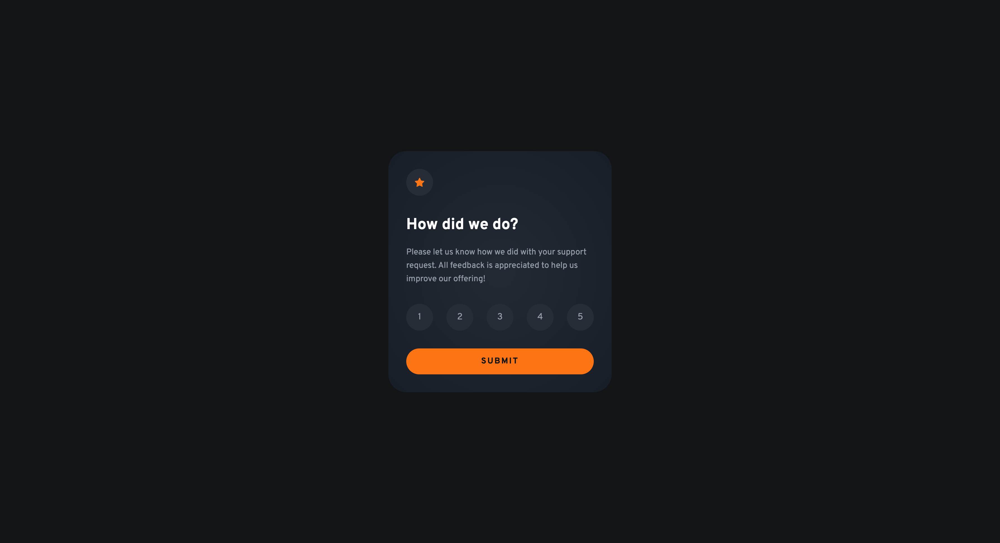

# Frontend Mentor - Interactive rating component solution

This is a solution to the [Interactive rating component challenge on Frontend Mentor](https://www.frontendmentor.io/challenges/interactive-rating-component-koxpeBUmI). Frontend Mentor challenges help you improve your coding skills by building realistic projects. 

## Table of contents

- [Overview](#overview)
  - [The challenge](#the-challenge)
  - [Screenshot](#screenshot)
  - [Links](#links)
- [My process](#my-process)
  - [Built with](#built-with)
  - [What I learned](#what-i-learned)
  - [Continued development](#continued-development)
  - [Useful resources](#useful-resources)
- [Author](#author)
- [Acknowledgments](#acknowledgments)

## Overview

### The challenge

Users should be able to:

- View the optimal layout for the app depending on their device's screen size
- See hover states for all interactive elements on the page
- Select and submit a number rating
- See the "Thank you" card state after submitting a rating

### Screenshot

### Links

- Solution URL: [github.com/jyeharry/interactive-rating-component](https://github.com/jyeharry/interactive-rating-component)
- Live Site URL: [jyeharry.github.io/interactive-rating-component](https://jyeharry.github.io/interactive-rating-component)

## My process

### Built with

- Semantic HTML5 markup
- CSS custom properties
- Flexbox
- CSS Grid
- Mobile-first workflow
- [Vite](https://vite.dev/)

### What I learned

First time making a project with Vite. May have been overkill since it's only a simple project but it's good to start learning it.

One nice thing about Vite that benefited this challenge was that it comes with PostCSS preinstalled which allowed me to install the [Utopia](https://github.com/trys/utopia-core) package and use their APIs from within my CSS.

### Continued development

I'm looking forward to the next learning path on Frontend Mentor which is Advanced CSS. I used a translate transition on the two steps in the form but there's still more I'd like to do such as correctly transitioning `display: none;`.

It will also be good to continue strengthening my vanilla JS skills.

## Author

- Website - [Jye Harry](https://jyeharry.github.io)
- Frontend Mentor - [@jyeharry](https://www.frontendmentor.io/profile/jyeharry)

